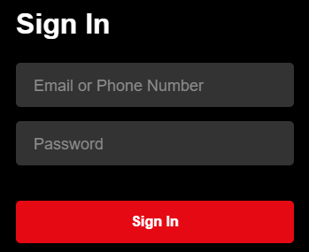
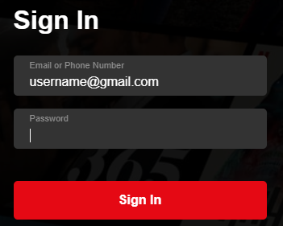

<h1>How to create Netflix style input box</h1>
<blockquote>In this short guide we are going to learn how to build Netflix style input box using vanilla HTML and CSS.
Author - Nikhil Nalande</blockquote>
 
<h2>Introduction</h2>
Welcome to my guide for building Netflix style form input boxes for your own projects. In this guide I'll walk you through step by step with required code and screenshots so you can understand better. At the end of this guide you will have made form as shown in screenshots below.  
 

Input box after it has text content in it or it is focused.

